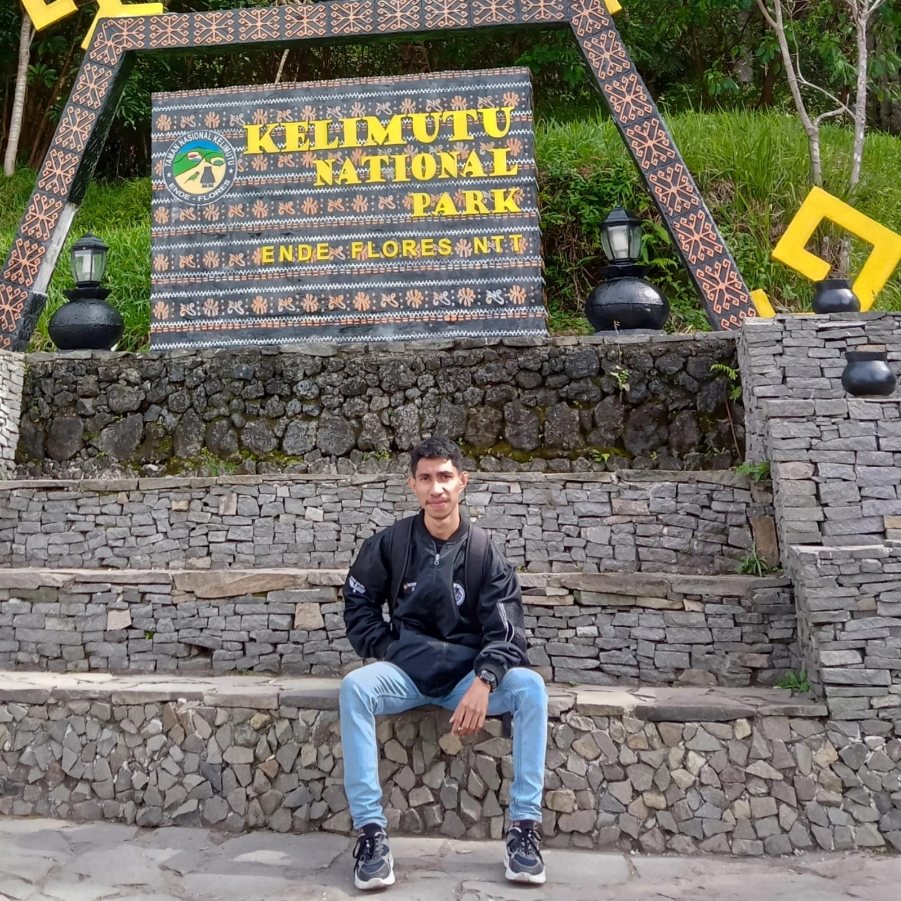
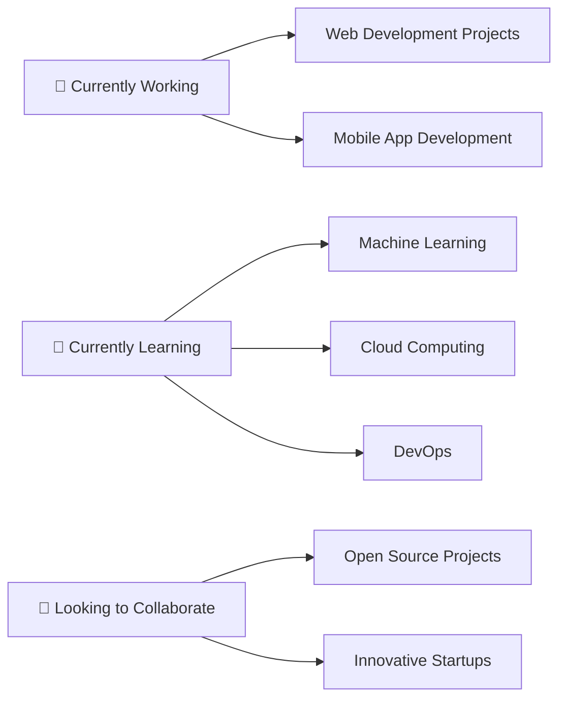

# 👋 Halo, Saya Yubi Bala!

<div align="center">
  <!-- Ganti dengan URL foto JPEG Anda -->
  
  
  <br><br>
  
  
</div>

<div align="center">
  
  
</div>

---

## 🚀 Tentang Saya

```javascript
const yubi = {
    nama: "Yubi bala",
    lokasi: "Indonesia 🇮🇩",
    peran: ["Full Stack Developer", "Software Engineer", "Tech Enthusiast"],
    bahasa: ["JavaScript", "Python", "Java", "TypeScript", "PHP"],
    framework: ["React", "Node.js", "Express", "Laravel", "Vue.js"],
    database: ["MySQL", "MongoDB", "PostgreSQL"],
    tools: ["Git", "Docker", "VS Code", "Figma"],
    hobi: ["Coding", "Gaming", "Reading Tech Blogs", "Open Source"],
    motto: "Code with passion, learn with curiosity! 💻✨"
};
```

---

## 🛠️ Tech Stack & Tools

<div align="center">

### 💻 Programming Languages


### 🌐 Frontend Development


### ⚙️ Backend Development


### 🗄️ Database


### 🛠️ Tools & Technologies


</div>

---

## 📊 GitHub Statistics

<div align="center">
  
  
</div>

<div align="center">
  
</div>

<div align="center">
  
</div>

---

## 🏆 GitHub Trophies

<div align="center">
  
</div>

---

## 🎯 Current Focus

<div align="center">



</div>

- 🔭 **Sedang mengerjakan:** Proyek web development dan mobile app
- 🌱 **Sedang belajar:** Machine Learning, Cloud Computing, dan DevOps
- 👯 **Ingin berkolaborasi:** Proyek open source dan startup inovatif
- 🤔 **Mencari bantuan:** Advanced algorithms dan system design
- 💬 **Tanya saya tentang:** Web development, programming, dan teknologi terbaru
- ⚡ **Fun fact:** Saya bisa coding sambil mendengarkan musik selama berjam-jam! 🎵

---

## 🌟 Featured Projects

<div align="center">

[](https://github.com/yubiwangak19/awesome-project)
[](https://github.com/yubiwangak19/cool-webapp)

</div>

---

## 📈 Contribution Graph

<div align="center">
  
</div>

---

## 🤝 Mari Terhubung!

<div align="center">

[](https://linkedin.com/in/yubiwangak19)
[](https://twitter.com/yubiwangak19)
[](https://instagram.com/yubiwangak19)
[](https://discord.gg/yubiwangak19)
[](mailto:yubiwangak19@gmail.com)

</div>

---

## 💝 Support My Work

<div align="center">

Jika Anda menyukai proyek-proyek saya, pertimbangkan untuk memberikan ⭐ pada repository saya!

[](https://buymeacoffee.com/yubiwangak19)
[](https://ko-fi.com/yubiwangak19)

</div>

---

<div align="center">
  
</div>

<div align="center">
  <i>⭐ Dari <a href="https://github.com/yubiwangak19">yubiwangak19</a> dengan ❤️</i>
</div>