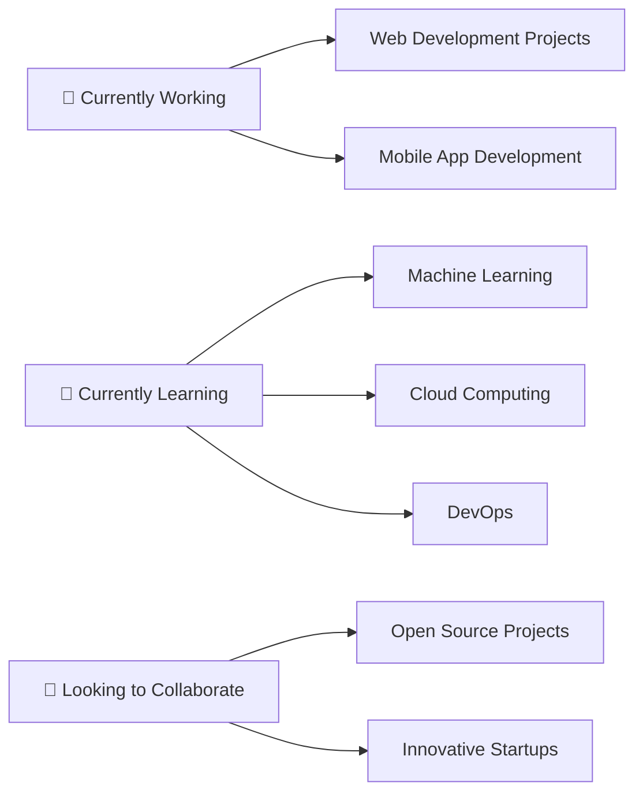

<div align="center">
  
</div>

<div align="center">
  
  
  <br><br>
  
  
</div>

<div align="center">
  
  
  
</div>

<div align="center">
  
</div>

---

## 🚀 Tentang Saya

<div align="center">
  
</div>

<table align="center">
<tr>
<td valign="top" width="50%">

### 👨‍💻 Quick Facts
```javascript
const yubi = {
    nama: "Yubi Bala",
    lokasi: "Indonesia 🇮🇩",
    umur: "calculateAge(birthDate)",
    status: "Available for work",
    passion: "Building amazing things",
    coffee: "☕ Unlimited cups per day",
    motto: "Code with passion! 💻✨"
};
```

</td>
<td valign="top" width="50%">

### 🎯 Skills & Interests
- 🚀 **Full Stack Development**
- 🤖 **Machine Learning Enthusiast**
- 🎮 **Game Development**
- 📱 **Mobile App Development**
- 🌐 **Web3 & Blockchain**
- 🎨 **UI/UX Design**
- 📊 **Data Science**
- ☁️ **Cloud Computing**

</td>
</tr>
</table>

---

## 🛠️ Tech Stack & Tools

<div align="center">

### 💻 Programming Languages


### 🌐 Frontend Development


### ⚙️ Backend Development


### 🗄️ Database


### 🛠️ Tools & Technologies


</div>

---

## 📊 GitHub Statistics

<div align="center">
  &nbsp;***My GitHub Stats***&nbsp;
</div>

<table align="center">
<tr>
<td width="50%">


</td>
<td width="50%">


</td>
</tr>
</table>

<div align="center">
  
</div>

<div align="center">
  
</div>

<div align="center">
  
</div>

---

## 🏆 GitHub Trophies

<div align="center">
  
</div>

---

## 🎯 Current Focus

<div align="center">



</div>

- 🔭 **Sedang mengerjakan:** Proyek web development dan mobile app
- 🌱 **Sedang belajar:** Machine Learning, Cloud Computing, dan DevOps
- 👯 **Ingin berkolaborasi:** Proyek open source dan startup inovatif
- 🤔 **Mencari bantuan:** Advanced algorithms dan system design
- 💬 **Tanya saya tentang:** Web development, programming, dan teknologi terbaru
- ⚡ **Fun fact:** Saya bisa coding sambil mendengarkan musik selama berjam-jam! 🎵

---

## 🌟 Featured Projects

<div align="center">

[](https://github.com/yubiwangak19/awesome-project)
[](https://github.com/yubiwangak19/cool-webapp)

</div>

---

## 🐍 Contribution Snake

<div align="center">
  
</div>

---

## 🤝 Mari Terhubung!

<div align="center">
   <em><b>Saya suka bertemu dengan orang-orang baru!</b> Jadi jika Anda ingin berkata hai, <b>saya akan senang bertemu dengan Anda!</b> 😊</em>
</div>

<div align="center">

[](https://linkedin.com/in/yubiwangak19)
[](https://twitter.com/yubiwangak19)
[](https://instagram.com/yubiwangak19)
[](https://discord.gg/yubiwangak19)
[](mailto:yubiwangak19@gmail.com)
[](https://t.me/yubiwangak19)
[](https://wa.me/yubiwangak19)

</div>

<div align="center">
  
  
  
</div>

---

## 💝 Support My Work

<div align="center">

Jika Anda menyukai proyek-proyek saya, pertimbangkan untuk memberikan ⭐ pada repository saya!

[](https://buymeacoffee.com/yubiwangak19)
[](https://ko-fi.com/yubiwangak19)

</div>

---

<div align="center">
  
</div>

<div align="center">
  <i>⭐ Dari <a href="https://github.com/yubiwangak19">yubiwangak19</a> dengan ❤️</i>
</div>
